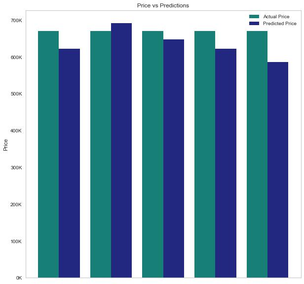

# Multiple Linear Regression in King County

## Business Problem
We have been hired by Compass Real Estate to answer two questions: 
What are the most influential features on house sale price? 
Where in King County should Compass allocate resources?

## Data
This project uses the King County House Sales dataset, which can be found in  `kc_house_data.csv` in the data folder in this assignment's GitHub repository. The description of the column names can be found in `column_names.md` in the same folder. These data are originally from the King County [website](https://gis-kingcounty.opendata.arcgis.com/). Geospatial is from [gis-kingcounty.opendata.arcgis.com](https://gis-kingcounty.opendata.arcgis.com/datasets/zipcodes-for-king-county-and-surrounding-area-shorelines-zipcode-shore-area/explore?location=47.496708%2C-121.477600%2C8.93)

## Methodology
We used pandas and numpy explore the data. Sklearn and statsmodel.api to determine R scores and the root mean squared error. Matplotlib, seaborn, and folium  were used for visualizations. We droped duplicates and filled nulls with the most common value in the column. Then we one hot encoded categorical variables. Next we ran a train-test split on the data and removed outliers to avoid data leakage. Additionally, we standard scaled our train and test, ran numerous models comparing different features, and proceeded to visualize our findings. 

## Features
We tested multiple models and combinations and found that four features effected price the most. The first was zipcode. The location was a key feature in determining the home sale price. 

Our second feature was squarefeet of the living space. As living space increases so does the value of a home 

Our third feature is grade. It turned out to be an immensely important feature in determining a home's value. As a home's grade goes up so does it's price. 

And our final feature was view. As you can see, the better the view and the higher the price. 

## Model
Now lets say we wanted to figure out the price of a home by pulgging in different features. we can do that with our predcitive price model. We need the zipcode, square feet of the living space, the grade recieved, and the quality of the view. give us those 4 features and we can figure out the price of a home with 81.6% accuracy and only be off by about $50,0000. 

## Conclusions
We found the most predictive features to be square feet of the living space, grade, view and zipcode. The neighborghoods where Compass should allocated it's manpower and marketing resources are Seattle, Shoreline, Lake Forest Park, Bellevue, Mercer Island, Newcastle, Sammamish, Issaquah, Carnation, Duvall. These towns have the most listings and highest average prices. Buffing up your presensce in these areas could lead to more business and higher commissions. 